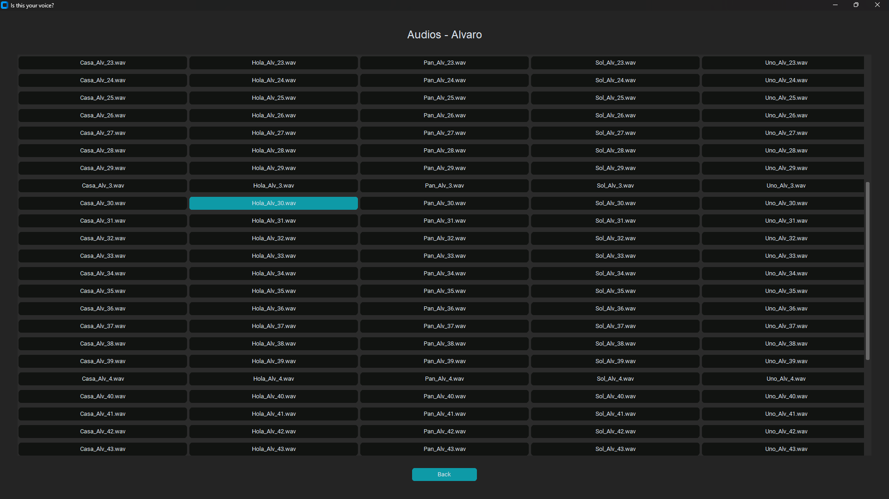

# Is this your voice?
## VOice Classifier 

**Is this your voice?** is a Python application designed to classify voice recordings using machine learning models (K-Nearest Neighbors and Support Vector Machine). It includes a graphical interface built with `customtkinter` for training, evaluating, and classifying audio data using various acoustic descriptors.

---

## Features
- **Graphical Interface**: Intuitive interface for training models, evaluating performance, and classifying audio.
- **Algorithm Support**: Supports KNN and SVM for classification.
- **Audio Processing**: Extracts meaningful acoustic descriptors for analysis.
- **Visualization**: Displays confusion matrices, classification reports, and accuracy metrics.
- **Customization**: Allows selection of descriptors, test sizes, and hyperparameters.

---

## Project Organization
The project is organized as follows:
1. Data
2. Models
3. resources
4. scripts
5. main.py
6. requirements.py
7. README.md

---

# How It Works
## Initial Screen
Press "Start"


## Main Menu
Here, you can choose three options: Visualize data, Training or Classification.


## Visualize Data Section
1. Press the image:

2. Now there are four options, this means that there are data (audios) from four people. 

3. Choose one person:

4. Now, the data (audios) is shown by five differents categories (Casa, Hola, Pan, Sol, Uno). There are 50 audios per category.

5. You can select any audio shown and press the button to listen to it.


## Training Section
1. Press the image:

2. Now there are two options, there are two models to use for training. K-Nearest Neighbors (KNN) and Support Vector Machine (SVM)


### K-Nearest Neighbors (KNN) Section
1. To start training using the KNN model, press the button:

2. The KNN menu will be displayed, where there are some sections like parameters, features, action buttons and results. 

3. Select the parameters and features you want your model to have.

4. Now, press the button "Train" and it will appear a message like this:

5. Once your model has been trained, then the results will be shown:

6. You can save the trained model by pressing the "Save" button


### Support Vector Machine (SVM) Section
1. To start training using the SVM model, press the button:

2. The KNN menu will be displayed, where there are some sections like parameters, features, action buttons and results. 

3. Select the parameters and features you want your model to have.

4. Now, press the button "Train" and it will appear a message like this:

5. Once your model has been trained, then the results will be shown:

6. You can save the trained model by pressing the "Save" button


## Classification Section
1. Press the image:

2. Now, the classification screen will be shown. 

3. To start classifying audios, you need to press the "Choose Model" button and select a previous trained model, it can be KNN or SVM, it does not matter.

4. Select model

5. Selected model


### Classify recorded audios (.wav)
1. Press the "Record Audio" button and you have 2 seconds to say one of the allowed words (Casa, Hola, Pan, Sol, Uno). 

2. Once the 2 seconds are up, the model will classify your word said in the audio as (Casa, Hola, Pan, Sol, Uno) and even will classify the person who said the word. 

3. If you want, you can listen to the recorded audio by pressing the image button.


### Classify audios from your system (.wav)
1. Press the "Choose Audio" button and select the audio you want.

2. Once you have chosen the audio, the model will classify your word said in the audio as (Casa, Hola, Pan, Sol, Uno) and even will classify the person who said the word.

3. If you want, you can listen to the chosen audio by pressing the image button.


---

## Acoustic Descriptors
The following acoustic descriptors are used in this project:
- **MFCC**: Mel-Frequency Cepstral Coefficients.
- **Spectral Centroid**: Represents the center of gravity of the spectrum.
- **Spread**: Measures the spectral bandwidth.
- **Skewness**: Describes the asymmetry of the spectrum.
- **Kurtosis**: Describes the sharpness of the spectral peak.
- **Slope**: Linear regression of the spectrum.
- **Decrease**: Measures energy decrease across the spectrum.
- **Roll-off**: Frequency below which a percentage of the total energy is contained.
- **Zero-Crossing Rate**: Measures the rate of sign changes in the waveform.
- **Log-Attack Time**: Logarithm of the time taken for the signal to reach its maximum amplitude.
- **AM Index**: Amplitude modulation index.
- **Pitch**: Average pitch of the signal.
- **MPEG7 Features**: Centroid, Spread, Flatness.

---
## Machine Learning Algorithms

### 1. K-Nearest Neighbors (KNN)
- **Description**: A non-parametric algorithm that classifies data points based on the majority class of their nearest neighbors.
- **Parameters**:
  - `n_neighbors`: Number of neighbors considered for classification.
- **Advantages**:
  - Simple and interpretable.
  - Works well with small datasets.
- **Disadvantages**:
  - Slower with large datasets.
  - Sensitive to irrelevant features.

### 2. Support Vector Machine (SVM)
- **Description**: A supervised learning algorithm that finds the hyperplane that best separates classes in feature space.
- **Parameters**:
  - `kernel`: Type of kernel (e.g., linear, RBF, polynomial).
  - `C`: Regularization parameter.
  - `gamma`: Kernel coefficient for RBF and polynomial kernels.
- **Advantages**:
  - Effective in high-dimensional spaces.
  - Robust to overfitting.
- **Disadvantages**:
  - Computationally expensive for large datasets.
  - Requires careful parameter tuning.

---
## Data
The dataset is organized into subfolders for each person and word:
Data-------
----------Alvaro
-----------------Casa (50 audios)
-----------------Hola (50 audios)
-----------------Pan (50 audios)
-----------------Sol (50 audios)
-----------------Uno (50 audios)
----------Angel
-----------------Casa (50 audios)
-----------------Hola (50 audios)
-----------------Pan (50 audios)
-----------------Sol (50 audios)
-----------------Uno (50 audios)
----------Carlos
-----------------Casa (50 audios)
-----------------Hola (50 audios)
-----------------Pan (50 audios)
-----------------Sol (50 audios)
-----------------Uno (50 audios)
----------Navil
-----------------Casa (50 audios)
-----------------Hola (50 audios)
-----------------Pan (50 audios)
-----------------Sol (50 audios)
-----------------Uno (50 audios)

Each `.wav` file represents a 2-second audio recording sampled at 44.1 kHz.

---

## How to Run
1. Clone the repository:
   ```bash
   git clone https://github.com/AlvaroVasquezAI/Voice_Classifier.git
   cd Voice_Classifier
   ```

2. Install dependencies:
   ```bash
   pip install -r requirements.txt
   ```
3. Run the application:
   ```bash
   python main.py
   ```
4. Interact with the graphical interface to train models, evaluate performance, and classify audio.

---
## License
This project is licensed under the MIT License. See `LICENSE` for more details.

---

## Contributing
Contributions are welcome! Feel free to open issues or submit pull requests.

---

## Acknowledgments
- **Libraries**: `numpy`, `librosa`, `customtkinter`, `sounddevice`, `pillow`, `pandas`, `matplotlib`, `scikit-learn`, `soundfile`. 
- **Tools**: Python, Tkinter, Machine Learning.
- Special thanks to everyone who supports this project!

